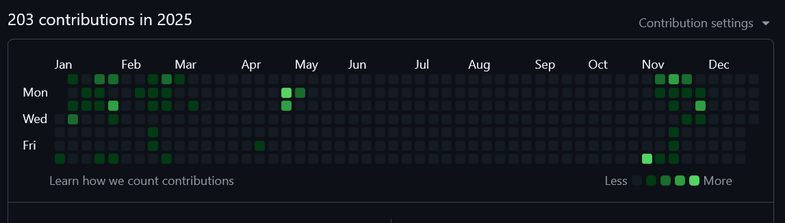
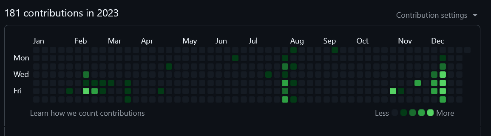
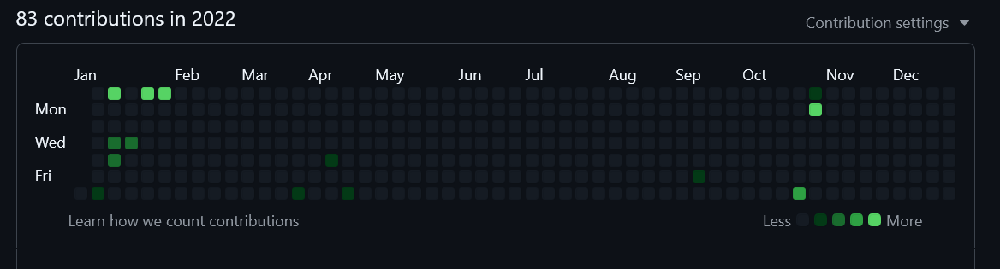
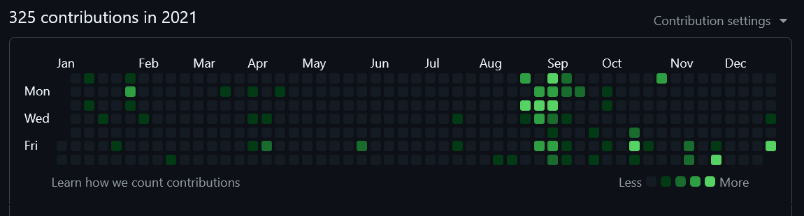
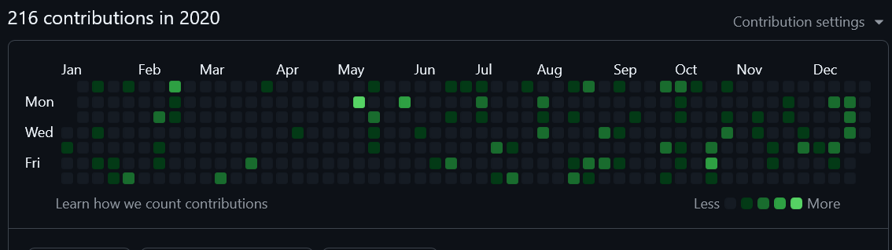
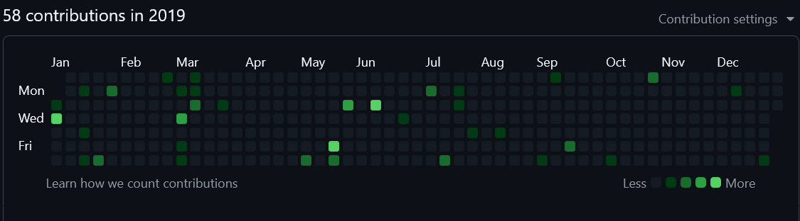
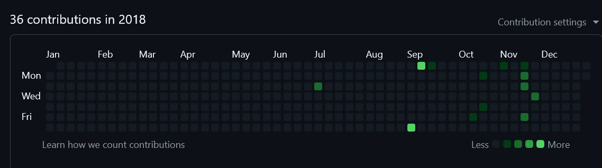

# Hi, I'm Jack 👋

I'm a UK based software developer with a BSc Hons in Software Engineering.

### Activity Map

My GitHub profile is marked as private as this is unfortunately the only way to hide the list of followers and
following.
This has the unfortunate effect of also hiding the activity / contribution map. I am currently working on a creating
a way to display an automatically updating version of that here, but meanwhile I have attached screenshots of
my map for the past few years below, correct as of last update.

Last updated: 4th December 2025.

2025

 

2024

2023

2022

2021

2020

2019

2018

